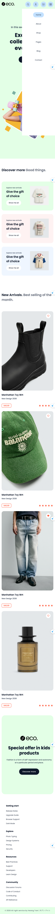

# Ciseco - An eCommerce Website


Ciseco - Multipurpose ECommerce is a fully responsive ecommerce website, maximum compatiblities in all mobile devices, built using HTML, CSS, and JavaScript.

## Demo

You can view demo website at: [https://tranvuhoang.github.io/frontend-htmlcss-03/](https://tranvuhoang.github.io/frontend-htmlcss-03/)


<!--  -->

## Prerequisites

Before you begin, ensure you have met the following requirements:

- [Git](https://git-scm.com/downloads "Download Git") must be installed on your operating system.

## Installing Ciseco

To install **Ciseco**, follow these steps:

Linux and macOS:

```bash
sudo git clone https://github.com/TranVuHoang/frontend-htmlcss-03.git
```

Windows:

```bash
git clone https://github.com/TranVuHoang/frontend-htmlcss-03.git
```

## Contact

If you want to contact me you can reach me at [Twitter](https://www.twitter.com/thoandanh29).

## License

This project is **free to use** and does not contains any license.
